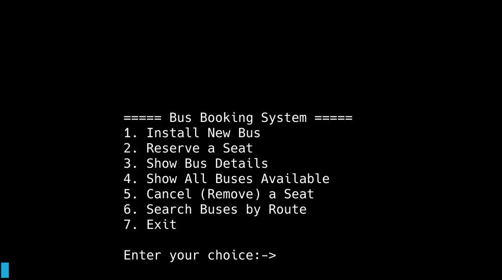
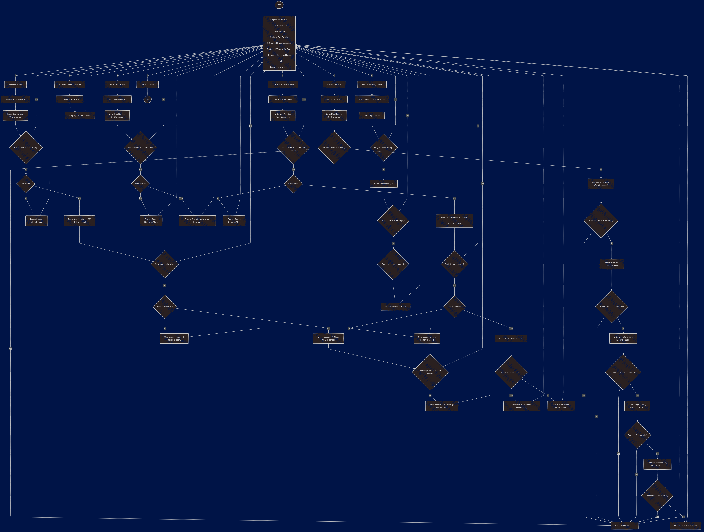

# **Bus Booking System**


A **console-based** bus booking application written in C++. It allows users to book and manage bus seats, display bus details, search routes, and more—all through a **simple, menu-driven** interface.

---

## Table of Contents

- [Overview](#overview)
- [Key Features](#key-features)
- [System Design & Principles](#system-design--principles)
- [Core Components](#core-components)
- [Installation](#installation)
- [Usage](#usage)
- [Contributing](#contributing)
- [License](#license)
- [Contact](#contact)
- [User Flow Diagram](#user-flow-diagram)

---

## Overview

The **Bus Booking System** provides these core functionalities:

1. **Install (Add) a New Bus**
   - Enter bus details (bus number, driver, times, origin, destination).
   - Cancel at any prompt by typing `0` or leaving it empty.

2. **Reserve a Seat**
   - Select a bus by its bus number, pick a seat (1–32), and book it under a passenger name.

3. **Show Bus Details**
   - Displays comprehensive info for a bus, including a seat map, fare, and seat occupancy.

4. **Show All Buses**
   - Lists all installed buses, showing concise details.

5. **Cancel a Seat**
   - Frees up a previously reserved seat on a bus.

6. **Search Buses by Route**
   - Finds buses matching a given `origin` → `destination`.

7. **Exit**
   - Ends the program gracefully.

---

## Key Features

- **32-Seat Layout**: Each bus has 8 rows × 4 columns = 32 seats total.
- **Default Seat Fare**: Each seat includes a `fare` field (initially 300.0, adjustable in code).
- **User-Focused**: Cancels any operation if `0` or empty input is entered.
- **In-Memory Storage**: Data is reset when the program terminates (no persistence).

---

## System Design & Principles

- **Modularity**: Each *Bus* is encapsulated in a `Bus` class, which manages seat info and bus data. A global `std::vector<Bus>` (`busList`) holds all bus objects.
- **Loose Coupling**: Functions like `searchBusesByRoute()` operate on the global bus list and only rely on each bus’s public interface.
- **Simplicity**: Menu-driven design with minimal dependencies. Users can quickly navigate through numeric choices.
- **C++ Standard Library**: Utilizes `<vector>`, `<algorithm>`, and standard I/O for ease of maintenance and clarity.
- **Error Handling / Cancellation**: If the user enters `"0"` or empty input at critical prompts, the operation is cancelled to prevent partial data.

---

## Core Components

1. **`Bus` Class**
   - Holds bus details: number, driver, times, route (`from`, `to`).
   - Maintains a 2D vector of `Seat`, each seat having `passengerName` and `fare`.
   - Functions for installation, allotment (reservation), cancellation, and displaying the bus.

2. **Global Functions**
   - `showAllBuses()`: Lists all buses.
   - `searchBusesByRoute()`: Filters buses by matching route.
   - `printLine()`, `clearScreen()`: Utilities for UI.

3. **`main()` Menu Logic**
   - Presents a loop with numeric choices.
   - Interacts with the `Bus` class or global functions to fulfill user requests.

---

## Installation

### Prerequisites

- **C++ Compiler**: Ensure you have a C++11 compatible compiler installed (e.g., `g++`, `clang++`).

### Steps

1. **Clone the Repository**
    ```bash
    git clone https://github.com/yourusername/bus-booking-system.git
    cd bus-booking-system
    ```

2. **Compile the Code**
    ```bash
    g++ -std=c++11 -o BusBookingSystem main.cpp
    ```

3. **Run the Application**
    ```bash
    ./BusBookingSystem
    ```

---

## Usage

Upon running the application, you will be presented with a menu:



### Operations

1. **Install New Bus**
   - Input bus details as prompted.
   - Enter `0` or leave empty at any prompt to cancel.

2. **Reserve a Seat**
   - Select a bus by its number.
   - Choose a seat number (1-32).
   - Enter passenger's name to reserve.

3. **Show Bus Details**
   - Input the bus number to view detailed information and seat map.

4. **Show All Buses Available**
   - Displays a list of all installed buses with basic details.

5. **Cancel (Remove) a Seat**
   - Select a bus and seat number to cancel the reservation.

6. **Search Buses by Route**
   - Enter origin and destination to find matching buses.

7. **Exit**
   - Terminates the application.

---

## Contributing

Contributions are welcome! Please follow these steps:

1. **Fork the Repository**
2. **Create a Feature Branch**
    ```bash
    git checkout -b feature/YourFeature
    ```
3. **Commit Your Changes**
    ```bash
    git commit -m "Add Your Feature"
    ```
4. **Push to the Branch**
    ```bash
    git push origin feature/YourFeature
    ```
5. **Open a Pull Request**

Please ensure your code follows the project's coding standards and includes appropriate documentation.

---

## License

This project is licensed under the [MIT License](LICENSE).

---

## Contact

For any inquiries or feedback, please contact:

- **Name**: Rajeev Ranjan
- **Email**: rajeevranjancm015@gmail.com
- **GitHub**: [RajeevRanjan27](https://github.com/RajeevRanjan27)

---

## User Flow Diagram

Below is a simplified diagram showing how a user navigates the system:



---


